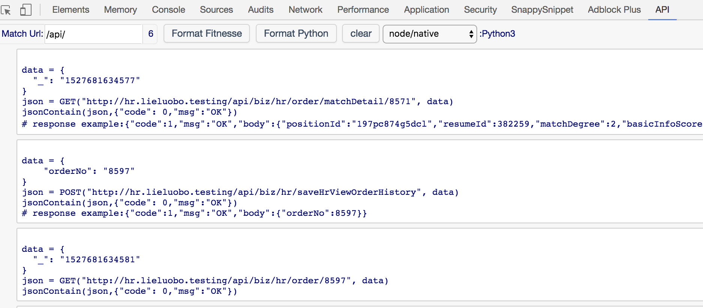

## change log
  - 2018-01-10:增加局域网同步进度的功能,现在标记的进度大家共享.(依赖于另一个同步服务)

## 一个临时插件
    用于导出umock中的接口清单, 暂只能一次一个页面导出.
    原理很清楚,直接用jqery获取元素然后取值,然后存localStorage
# Setup
1. Clone
1. Visit [chrome://extensions](chrome://extensions)
1. Turn on "Developer Mode"
1. Click "Load Unpacked extension..."
1. Select the repo directory
1. edit manifest.json ,change ["http://yoda:9001/server/*"]" to ["<all_urls>"]
1. reload

>You can also drag and drop the directory on to the extensions page

You can refer to the Chrome extension [Get Started](https://developer.chrome.com/extensions/getstarted) page for more.

    
    npm install
    cp node_modules/httpsnippet-fe/dist/httpsnippet-dist.js src

# Preview 

## 导出功能已经不维护了
功能直接加到umock中了   
 
    --
     "content_scripts": [
        {
          "matches": ["http://yoda:9001/server/*","http://*.lieluobo.testing/*"],
          "js": [
            "lib/jquery-3.2.1.min.js",
            "src/content.js",
            "lib/jquery-ui.min.js"
          ],
          "run_at":"document_end"
        }
      ],

         -- "default_popup": "html/popup.html"

